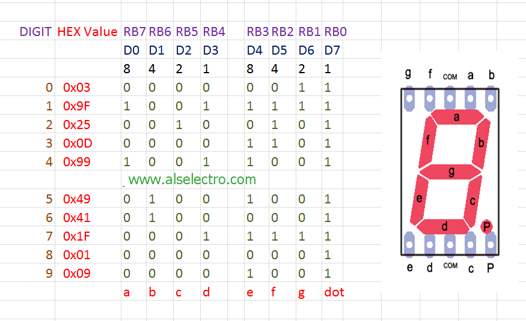

# Projeto 2 - Cronômetro Digital com Timer e Interrupções

## Disciplina: SEL0614 - Aplicação de Microprocessadores 
### Parte 2 - Microcontroladores PIC e Programação em Linguagem C

## Membros do Grupo

- Leonardo Gueno Rissetto (13676482)
- Thiago Kashivagui Gonçalves (13676579)
- Lucas Lima Romero (13676325)
- Marco Antonio Gaspar Garcia (11833581)

## 1. Resumo
Este projeto consiste no desenvolvimento de um cronômetro digital utilizando linguagem C para o microcontrolador PIC18F4550, implementado no kit EasyPIC v7 e simulado no SimulIDE. O cronômetro exibe números de 0 a 9 em um display de 7 segmentos, alternando entre intervalos de tempo de 1 segundo e 0,25 segundos, controlados por dois botões. O projeto explora o uso de temporizadores e interrupções para controle da contagem de tempo.

## 2. Objetivos
O objetivo deste projeto é explorar o funcionamento dos microcontroladores de 8 bits com arquitetura Harvard e set de instruções RISC, através da implementação de um cronômetro digital em linguagem C que utiliza botões, temporizadores e interrupções. Além disso, busca-se desenvolver habilidades na programação em C e no uso de periféricos do microcontrolador PIC18F4550.

### Específicos:
- Criar um cronômetro digital que conte de 0 a 9 em um display de 7 segmentos.
- Alternar o tempo de contagem entre 1 segundo e 0,25 segundos utilizando botões.
- Utilizar o temporizador TMR0 e interrupções para implementar o sistema de contagem.

## 3. Materiais e Métodos
### Materiais:
- **Microcontrolador**: PIC18F4550.
- **Kit de desenvolvimento**: EasyPIC v7.
- **Simulador**: SimulIDE.
- **Linguagem de programação**: C.

### Métodos:
O projeto foi desenvolvido utilizando o compilador MikroC PRO for PIC e testado no simulador SimulIDE com os seguintes componentes:
- **Botões**: Utilizados para controlar o intervalo de tempo da contagem.
- **Display de 7 segmentos**: Mostra os números de 0 a 9.
- **Temporizador TMR0 e interrupções**: Configurados para gerar os atrasos de 1 segundo e 0,25 segundos.

## 4. Descrição
### Inicialização:
- As portas RB0 e RB1 são configuradas como entrada para detectar os botões.
- O display de 7 segmentos está conectado à porta D, que exibe os números de 0 a 9.

### Funcionamento:
1. O programa inicia com o display desligado. A contagem só começa quando RB0 ou RB1 são pressionados.
2. **RB0**: Ao pressionar o botão conectado em RB0, o cronômetro conta de 0 a 9 com um intervalo de 1 segundo.
3. **RB1**: Ao pressionar o botão conectado em RB1, o intervalo de contagem é alterado para 0,25 segundos.
4. **Loop**: A contagem é contínua, alternando entre os intervalos de tempo conforme o botão pressionado.

### Configuração do Temporizador e Interrupções:
- **TMR0**: Configurado para gerar interrupções em intervalos regulares.
- **INT0 e INT1**: Interrupções externas associadas aos botões RB0 e RB1 para alterar o intervalo de tempo.

### Tabela de Segmentos:
O display de 7 segmentos utiliza uma tabela de valores para representar os números de 0 a 9. A porta D controla o display com base nos valores armazenados na tabela.

## 5. Resultados e Discussão
O projeto foi implementado com sucesso no SimulIDE, atendendo aos seguintes requisitos:
- **Contagem correta de 0 a 9**: O display de 7 segmentos exibe os números na ordem correta e a contagem reinicia ao chegar a 9.
- **Alteração de intervalo de tempo**: O cronômetro altera a base de tempo corretamente entre 1 segundo e 0,25 segundos ao pressionar os botões de RB0 e RB1.
- **Loop contínuo**: A contagem ocorre indefinidamente até que a simulação seja parada.

### Exemplos do Funcionamento:
Aqui estão os GIFs demonstrando o funcionamento do cronômetro:

1. Contagem com intervalo de 0,25 segundos:

   

3. Contagem com intervalo de 1 segundo:
   
   

4. Mudança entre contagens:

   

Discussão: A implementação do cronômetro evidenciou a importância do uso de temporizadores e interrupções para o controle preciso do tempo e resposta aos botões. O controle via botões foi eficaz, demonstrando a capacidade do microcontrolador PIC18F4550 de gerenciar múltiplos eventos com precisão.

### Comparação entre Projetos: PIC18F em C vs. 8051 em Assembly

Este projeto atual, desenvolvido em linguagem C para o microcontrolador PIC18F, traz vantagens significativas em relação ao projeto anterior em Assembly para o 8051. A programação em C facilita a legibilidade e manutenção do código, permitindo abstrações mais elevadas e menor tempo de desenvolvimento. Além disso, o PIC18F oferece maior velocidade de processamento e mais recursos de hardware. No entanto, a implementação em Assembly no 8051 possui a vantagem de maior controle sobre o hardware, resultando em um código mais eficiente em termos de recursos.

## 6. Como executar o código

Para executar o projeto e ver o cronômetro em ação, siga os passos abaixo:

### Instalação do SimulIDE e MikroC PRO for PIC:
1. Baixe e instale o simulador SimulIDE e o compilador MikroC PRO for PIC.
2. Configure o projeto no MikroC PRO for PIC para o PIC18F4550 com frequência de clock de 8 MHz.

### Executando o Código:
1. No MikroC PRO for PIC, abra o arquivo `.c` do projeto e compile para gerar o arquivo `.hex`.
2. No SimulIDE, monte o circuito com o PIC18F4550, conecte os botões em RB0 e RB1 e o display de 7 segmentos na porta D.
3. Carregue o arquivo `.hex` compilado no SimulIDE e inicie a simulação.

### Simulação:
1. Pressione os botões RB0 e RB1 no SimulIDE para controlar o cronômetro conforme descrito anteriormente.
2. Para parar a simulação, clique no botão **Stop**.

## 7. Conclusão
O desenvolvimento deste projeto permitiu aplicar conceitos importantes de sistemas embarcados e microcontroladores, como o uso de temporizadores, interrupções e portas de entrada/saída. A implementação no SimulIDE demonstrou o funcionamento correto do cronômetro digital, alcançando os objetivos propostos. Este projeto reforçou o entendimento sobre a programação em C e o uso prático do microcontrolador PIC18F4550 para controle de eventos e interfaces externas.
